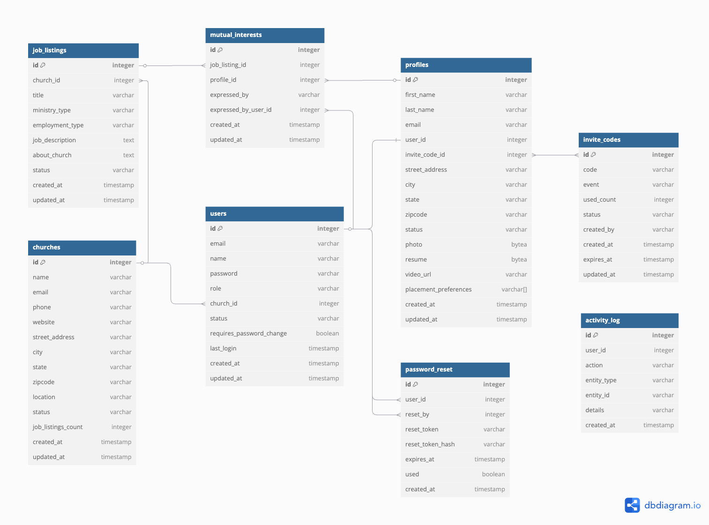

# API & Data Model Documentation

This document describes the core data models and API endpoints for the Minister Connect application. This includes both implemented features and planned features for future development.

## Database Schema



---

## Current Implementation Status

### ✅ Implemented Models & Endpoints

- User Management (with JWT authentication)
- Church Management
- Invite Code System
- Candidate Registration

### 🚧 Planned Models & Endpoints

- Profile Management
- Job Listings
- Mutual Interests
- Activity Logging
- Dashboard Statistics
- Password Reset System

---

## 1. Churches Model ✅

**Status**: Implemented in backend

```json
{
  "id": 1,
  "name": "Grace Fellowship Church",
  "email": "contact@gracefellowship.org",
  "phone": "555-111-1111",
  "website": "https://gracefellowship.org",
  "street_address": "123 Church Rd",
  "city": "Springfield",
  "state": "IL",
  "zipcode": "62704",
  "status": "active",
  "created_at": "2024-01-01T00:00:00.000Z",
  "updated_at": "2024-01-01T00:00:00.000Z"
}
```

**Available Endpoints:**

- `POST /api/churches/create/` — Create new church (requires authentication)

---

## 2. Users Model ✅

**Status**: Implemented in backend

```json
{
  "id": 1,
  "email": "admin@ministerconnect.com",
  "name": "Super Admin User",
  "username": "admin", // Required by Django AbstractUser
  "church_id": null,
  "status": "active", // "active", "inactive", "pending"
  "requires_password_change": false,
  "created_at": "2024-01-01T00:00:00.000Z",
  "updated_at": "2024-01-01T00:00:00.000Z"
}
```

**Available Endpoints:**

- `POST /api/users/create/` — Create new user (requires authentication)
- `GET /api/user/me/` — Get current user info (requires authentication)

**Authentication Endpoints:**

- `POST /api/token/` — Obtain JWT token
- `POST /api/token/refresh/` — Refresh JWT token

---

## 3. Invite Codes Model ✅

**Status**: Implemented in backend

```json
{
  "id": 1,
  "code": "CHURCH2024",
  "event": "Spring 2024 Church Registration",
  "used_count": 3,
  "status": "active", // "active", "expired"
  "created_by": 1,
  "created_by_name": "Jane Doe", // Additional field in API response
  "expires_at": "2024-12-31T23:59:59.000Z",
  "created_at": "2024-01-01T00:00:00.000Z",
  "updated_at": "2024-01-01T00:00:00.000Z"
}
```

**Available Endpoints:**

- `POST /api/invite-codes/create/` — Create invite code (requires authentication)
- `GET /api/invite-codes/` — List invite codes (requires authentication)

---

## 4. Candidate Registration ✅

**Status**: Implemented in backend

**Registration Endpoint:**

- `POST /api/candidates/register/` — Register new candidate (no authentication required)

**Request Body:**

```json
{
  "invite_code": "CANDIDATE2024",
  "email": "candidate@example.com",
  "password": "securepassword",
  "first_name": "Jane",
  "last_name": "Doe"
}
```

**Response:**

```json
{
  "detail": "Registration successful. Please log in."
}
```

---

## 5. Profiles Model 🚧

**Status**: Planned for future implementation

```json
{
  "id": 1,
  "first_name": "John",
  "last_name": "Doe",
  "email": "john.candidate@email.com",
  "user_id": 3,
  "invite_code_id": 1,
  "street_address": "789 Candidate Ave",
  "city": "Springfield",
  "state": "IL",
  "zipcode": "62701",
  "status": "approved", // "pending", "approved", "rejected"
  "photo": "/sampleman.jpg",
  "resume": "/student-pastor-resume.pdf",
  "video_url": "https://www.youtube.com/live/jfKfPfyJRdk",
  "placement_preferences": ["Youth Ministry", "Missions"],
  "submitted_at": "2024-01-20T14:30:00.000Z",
  "created_at": "2024-01-01T00:00:00.000Z",
  "updated_at": "2024-01-01T00:00:00.000Z"
}
```

**Planned Endpoints:**

- `GET /api/profile` — Get candidate profile
- `POST /api/profile` — Update candidate profile
- `POST /api/profile/upload` — Upload candidate document
- `GET /api/profiles` — List all profiles (superadmin)
- `POST /api/profiles/:id/review` — Approve/reject profile (superadmin)

---

## 6. Job Listings Model 🚧

**Status**: Planned for future implementation

```json
{
  "id": 1,
  "church_id": 1,
  "title": "Youth Pastor",
  "ministry_type": "Youth",
  "employment_type": "Full Time with Benefits",
  "job_description": "We are seeking a passionate and experienced Youth Pastor to lead our growing youth ministry...",
  "about_church": "Grace Fellowship Church is a vibrant, multi-generational congregation...",
  "status": "approved", // "pending", "approved", "rejected"
  "created_at": "2024-01-01T00:00:00.000Z",
  "updated_at": "2024-01-01T00:00:00.000Z"
}
```

**Planned Endpoints:**

- `GET /api/job-listings` — List job listings (with optional status filter)
- `POST /api/job-listings` — Create new job listing
- `PUT /api/job-listings/:id` — Update job listing
- `DELETE /api/job-listings/:id` — Delete job listing

---

## 7. Mutual Interests Model 🚧

**Status**: Planned for future implementation

```json
{
  "id": 1,
  "job_listing_id": 1,
  "profile_id": 1,
  "expressed_by": "candidate", // "candidate", "church"
  "expressed_by_user_id": 3,
  "created_at": "2024-01-01T00:00:00.000Z",
  "updated_at": "2024-01-01T00:00:00.000Z"
}
```

**Planned Endpoints:**

- `GET /api/mutual-interests` — Get mutual interests for current user/church
- `POST /api/mutual-interests` — Express interest in a job/candidate
- `DELETE /api/mutual-interests/:id` — Remove interest

---

## 8. Activity Log Model 🚧

**Status**: Planned for future implementation

```json
{
  "id": 1,
  "user_id": 1, // User who performed the action (null for system events)
  "action": "profile_approved", // e.g., "profile_approved", "church_registered", "job_created"
  "entity_type": "profile", // "user", "church", "profile", "job_listing", "invite_code"
  "entity_id": 5, // ID of the affected entity
  "details": "Profile approved for John Smith",
  "created_at": "2024-01-15T10:30:00.000Z"
}
```

---

## 9. Dashboard Statistics Model 🚧

**Status**: Planned for future implementation

```json
{
  "total_users": 1247,
  "active_churches": 89,
  "job_listings": 156,
  "pending_reviews": 23,
  "recent_activity": [
    {
      "id": 1,
      "user_id": 1,
      "action": "profile_approved",
      "entity_type": "profile",
      "entity_id": 5,
      "details": "Profile approved for John Smith",
      "created_at": "2024-01-15T10:30:00.000Z"
    }
  ]
}
```

**Planned Endpoints:**

- `GET /api/superadmin/dashboard` — Get dashboard statistics
- `GET /api/superadmin/activity` — Get recent activity log

---

## 10. Password Reset Model 🚧

**Status**: Planned for future implementation

```json
{
  "id": 1,
  "user_id": 5,
  "reset_by": 1, // User ID who performed the reset
  "reset_token": "a1b2c3d4e5f6789012345678901234567890abcdef1234567890abcdef123456",
  "reset_token_hash": "hashed_version_of_token",
  "expires_at": "2024-01-22T23:59:59.000Z",
  "used": false,
  "created_at": "2024-01-15T10:30:00.000Z"
}
```

**Planned Endpoints:**

- `POST /api/forgot-password` — Request password reset
- `POST /api/reset-password` — Reset password using token
- `POST /api/validate-reset-token` — Validate reset token
- `POST /api/force-password-change` — Force password change on first login

---

## Planned API Endpoints (Not Yet Implemented)

### User Management (Additional)

- `GET /api/candidates` — List candidates (admin/church)
- `GET /api/churches` — List churches (admin)
- `GET /api/users` — List all users (superadmin)
- `PUT /api/users/:id` — Update user status (superadmin)

### Superadmin Operations 🚧

- `GET /api/superadmin/users` — List all users (superadmin)
- `PUT /api/superadmin/users/:id` — Update user status (superadmin)
- `GET /api/superadmin/profiles` — List all profiles (superadmin)
- `POST /api/superadmin/profiles/:id/review` — Approve/reject profile (superadmin)
- `GET /api/superadmin/churches` — List all churches (superadmin)
- `PUT /api/superadmin/churches/:id` — Update church status (superadmin)
- `POST /api/superadmin/users/:id/reset-password` — Generate reset token for user (superadmin)
- `GET /api/superadmin/users/:id/password-resets` — Get password reset history (superadmin)

### Admin Operations 🚧

- `POST /api/admin/review` — Admin approves/rejects candidate profile
- `POST /api/admin/review-job` — Admin approves/rejects job listing

---

## Development Notes

### Current Implementation

- ✅ JWT Authentication system
- ✅ User and Church management
- ✅ Invite code system with usage tracking
- ✅ Candidate registration with invite code validation
- ✅ PostgreSQL database with proper constraints
- ✅ Comprehensive test coverage

### Next Development Phase

- 🚧 Profile management system
- 🚧 Job listing creation and management
- 🚧 Mutual interest tracking
- 🚧 Admin and superadmin dashboards
- 🚧 Activity logging system
- 🚧 Password reset functionality

### API Integration Status

- Frontend is prepared with TypeScript interfaces for all planned models
- Mock API handlers exist for development without backend
- Centralized API client can switch between mock and real backend
- Environment variable configuration ready for backend integration

---

## Notes

- Update this document as new features are implemented
- Keep mock data and API responses in sync with this reference
- All timestamps are in ISO 8601 format
- Status fields use lowercase values: "pending", "approved", "rejected", "active", "inactive", "suspended"
- Employment types include: "Full Time with Benefits", "Part Time", "Internship"
- Ministry types are free-form text (e.g., "Youth", "Worship", "Missions", "Children", "Administration")
- User roles include: "candidate", "church", "admin", "superadmin"
