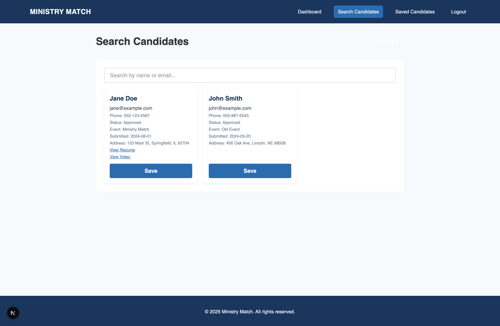
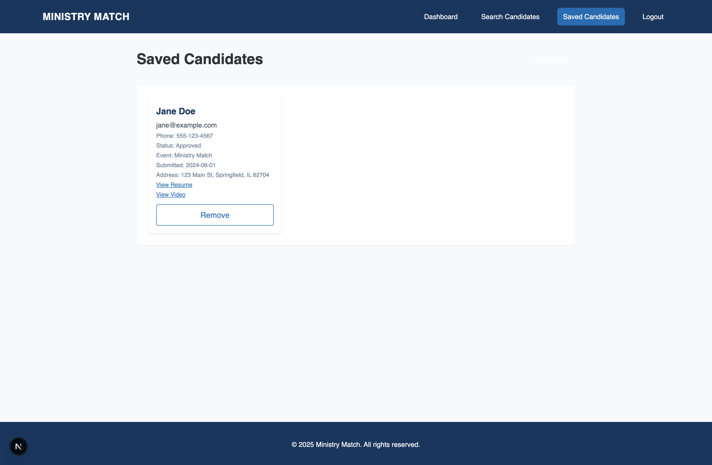
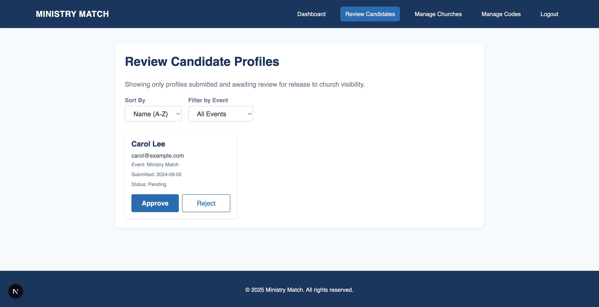
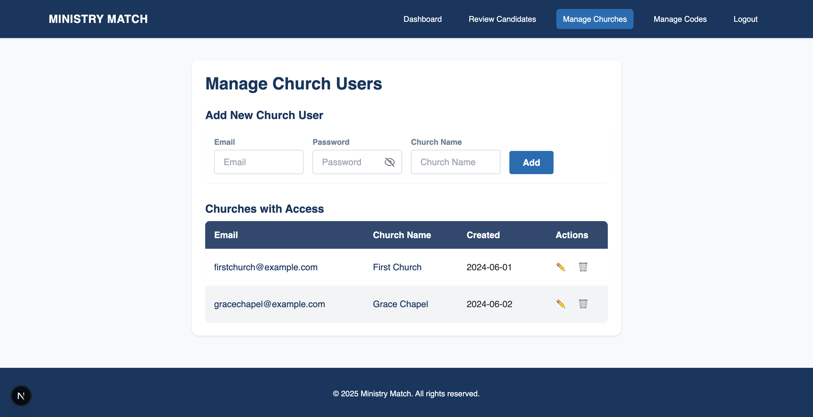
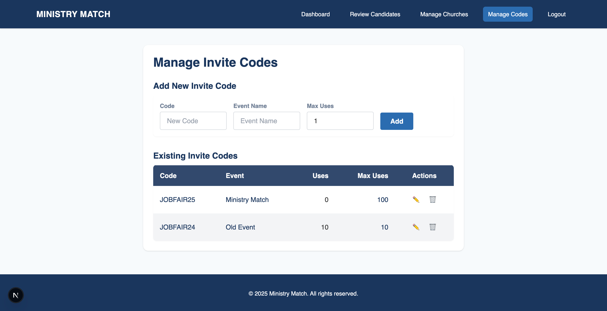

# Minister Connect

A multi-role Next.js application for connecting ministry candidates with churches, featuring role-based access for candidates, churches, and super admins. Built with React, TypeScript, Tailwind CSS, and MSW for frontend development and API mocking.

## Features

- **For Candidates**: Browse job listings, express interest, and manage profiles
- **For Churches**: Post job listings, browse candidates, and manage hiring process
- **For Admins**: Moderate content, manage users, and oversee platform operations

## Quick Start

```bash
npm install
npm run dev
```

The application will be available at `http://localhost:3000`

## Documentation

- **Use Case Diagram**: See `docs/use-case-diagram.puml` for the PlantUML source code
- **API Data Model**: See `API_DATA_MODEL.md` for detailed data structure information
- **Documentation**: See `docs/README.md` for additional documentation

### Use Case Diagram


## Screenshots

### Landing Page


### Login Page


### Register Page


### Candidate Dashboard


### Candidate Profile Form


### Church Dashboard


### Church Candidate Search


### Church Saved Candidates


### Admin Dashboard


### Admin Review Candidates


### Admin Manage Churches


### Admin Manage Invite Codes


--

## Tech Stack

- [Next.js](https://nextjs.org/) (v15+)
- [React](https://react.dev/) (v19+)
- [TypeScript](https://www.typescriptlang.org/)
- [Tailwind CSS](https://tailwindcss.com/)
- [MSW (Mock Service Worker)](https://mswjs.io/)

---

## Getting Started

### Prerequisites

- Node.js (v18+ recommended)
- Yarn or npm

### Installation

1. Clone the repository:
   ```
   git clone <repository-url>
   cd ministerconnect
   ```
2. Install dependencies:
   ```
   yarn install
   # or
   npm install
   ```
3. Start the development server:
   ```
   yarn dev
   # or
   npm run dev
   ```
   The app will be available at [http://localhost:3000](http://localhost:3000).

### Building for Production

```
yarn build
yarn start
# or
npm run build
npm start
```

---

## Folder Structure

```
ministerconnect/
├── public/                # Static assets & MSW worker
├── src/
│   ├── components/        # Shared React components (e.g., Header)
│   ├── pages/             # Next.js pages (see below)
│   │   ├── index.tsx      # Landing page
│   │   ├── auth/          # Login & registration
│   │   ├── candidate/     # Candidate profile & dashboard
│   │   ├── church/        # Church dashboard
│   │   └── admin/         # Admin dashboard & tools
│   ├── styles/            # Tailwind/global CSS
│   └── types/             # TypeScript types
├── API_DATA_MODEL.md      # API & data model documentation
├── tailwind.config.js     # Tailwind config
├── postcss.config.js      # PostCSS config
├── tsconfig.json          # TypeScript config
├── package.json           # Project metadata & scripts
└── README.md              # This file
```

---

## API & Data Model (Mocked)

See [`API_DATA_MODEL.md`](./API_DATA_MODEL.md) for full details.

### Database Schema


**Key Endpoints:**

- `POST /api/login` — Login user
- `POST /api/register` — Register candidate
- `POST /api/validate-invite` — Validate invite code
- `GET /api/candidates` — List applicants (admin/church)
- `GET /api/churches` — List churches (admin)
- `GET /api/profile` — Get candidate profile
- `POST /api/profile/upload` — Upload candidate document
- `POST /api/admin/review` — Admin approves/rejects candidate profile

**Core Models:**

- User (candidate, church, admin)
- Church
- Invite Code (supports multi-use)
- Candidate Profile/Upload

---

## Contributing

1. Fork the repository
2. Create a feature branch (`git checkout -b feature/your-feature`)
3. Commit your changes
4. Push to your fork and open a Pull Request

---

## License

This project is licensed under the MIT License. See `package.json` for details.
