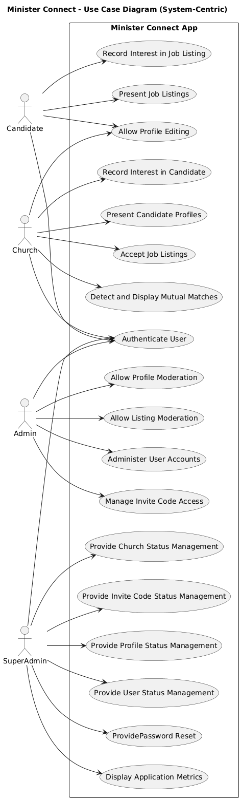

# Minister Connect

A multi-role Next.js application for connecting ministry candidates with churches, featuring role-based access for candidates, churches, admins, and super admins. Built with React, TypeScript, Tailwind CSS, and MSW for frontend development and API mocking.

## Features

### **For Candidates**
- **Profile Management**: Create and edit detailed ministry profiles with resume upload
- **Job Listings**: Browse available ministry positions with detailed job descriptions
- **Express Interest**: Show interest in specific job listings with one-click functionality
- **Profile Status Tracking**: Monitor approval status of submitted profiles
- **Document Upload**: Upload resumes and ministry videos

### **For Churches**
- **Job Posting**: Create detailed job listings with ministry type, employment details, and church information
- **Candidate Search**: Browse and search through approved candidate profiles
- **Express Interest**: Show interest in promising candidates
- **Mutual Interests**: View candidates who have expressed interest in your job listings
- **Church Profile Management**: Complete church profile with contact and location information

### **For Admins**
- **Content Moderation**: Review and approve/reject candidate profiles and job listings
- **User Management**: Monitor platform users and manage accounts
- **Invite Code Management**: Generate and manage registration invite codes
- **Church Oversight**: Review and manage church accounts

### **For Super Admins**
- **Complete Platform Management**: Full administrative control over the entire platform
- **User Management**: View, edit, and manage all user accounts (candidates, churches, admins)
- **Password Reset**: Reset passwords for any user with secure temporary password generation
- **Church Management**: Comprehensive church account oversight and status management
- **Profile Review**: Approve or reject candidate profiles with detailed review process
- **Invite Code System**: Advanced invite code management with usage tracking and expiration
- **Activity Monitoring**: Real-time dashboard with platform statistics and activity logs
- **Audit Trail**: Complete tracking of all administrative actions

## Quick Start

```bash
npm install
npm run dev
```

The application will be available at `http://localhost:3000`

## Test Accounts

### **Super Admin**
- Email: `superadminuser@gmail.com`
- Password: `password`

### **Admin**
- Email: `adminuser@gmail.com`
- Password: `password`

### **Church**
- Email: `churchuser@gmail.com`
- Password: `password`

### **Candidate (Approved Profile)**
- Email: `approvedcandidateuser@gmail.com`
- Password: `password`

## Documentation

- **Use Case Diagram**: See `docs/use-case-diagram.puml` for the PlantUML source code
- **API Data Model**: See `API_DATA_MODEL.md` for detailed data structure information
- **User Scenarios**: See `docs/user_scenarios/` for detailed user workflows
- **Documentation**: See `docs/README.md` for additional documentation

### Use Case Diagram


## User Journey Screenshots

### Landing Page


### Login Page


### Register Page


### Candidate Dashboard


### Candidate Profile Form


### Candidate Job Listings


### Church Dashboard


### Church Create Job Listing


### Church Manage Jobs


### Church Candidate Search


### Church Mutual Interests


### Admin Dashboard


### Admin Review Profiles


### Admin Church Management


### Admin Create Church


### Admin Edit Church


### Admin Review Job Listings


### Admin Manage Invite Codes


### Super Admin Dashboard


### Super Admin User Management


### Super Admin Profile Management


### Super Admin Church Management


### Super Admin Invite Code Management


## Tech Stack

- [Next.js](https://nextjs.org/) (v15+)
- [React](https://react.dev/) (v19+)
- [TypeScript](https://www.typescriptlang.org/)
- [Tailwind CSS](https://tailwindcss.com/)
- [MSW (Mock Service Worker)](https://mswjs.io/)

---

## Getting Started

### Prerequisites

- Node.js (v18+ recommended)
- Yarn or npm

### Installation

1. Clone the repository:
   ```bash
   git clone <repository-url>
   cd ministerconnect
   ```
2. Install dependencies:
   ```bash
   yarn install
   # or
   npm install
   ```
3. Start the development server:
   ```bash
   yarn dev
   # or
   npm run dev
   ```
   The app will be available at [http://localhost:3000](http://localhost:3000).

### Building for Production

```bash
yarn build
yarn start
# or
npm run build
npm start
```

---

## Folder Structure

```
ministerconnect/
├── public/                # Static assets & MSW worker
├── src/
│   ├── components/        # Shared React components
│   │   ├── ExpressInterestButton.tsx  # Reusable interest button
│   │   ├── Header.tsx                 # Navigation header
│   │   ├── Footer.tsx                 # Site footer
│   │   ├── PasswordInput.tsx          # Password input component
│   │   └── PDFViewer.tsx              # PDF viewing component
│   ├── mocks/             # API mocking
│   │   ├── browser.ts     # MSW browser setup
│   │   ├── data.ts        # Mock data definitions
│   │   └── handlers.ts    # API endpoint handlers
│   ├── pages/             # Next.js pages
│   │   ├── index.tsx      # Landing page
│   │   ├── auth/          # Authentication pages
│   │   │   ├── login.tsx
│   │   │   ├── register.tsx
│   │   │   ├── forgot-password.tsx
│   │   │   ├── reset-password.tsx
│   │   │   └── force-password-change.tsx
│   │   ├── candidate/     # Candidate pages
│   │   │   ├── index.tsx  # Dashboard
│   │   │   ├── profile.tsx
│   │   │   └── jobs.tsx   # Job listings
│   │   ├── church/        # Church pages
│   │   │   ├── index.tsx  # Dashboard
│   │   │   ├── search.tsx # Candidate search
│   │   │   ├── jobs.tsx   # Job management
│   │   │   ├── jobs/create.tsx
│   │   │   └── mutual-interests.tsx
│   │   ├── admin/         # Admin pages
│   │   │   ├── index.tsx
│   │   │   ├── review.tsx
│   │   │   ├── churches.tsx
│   │   │   ├── codes.tsx
│   │   │   └── jobs.tsx
│   │   └── superadmin/    # Super admin pages
│   │       ├── index.tsx  # Dashboard
│   │       ├── users.tsx  # User management
│   │       ├── churches.tsx
│   │       ├── profiles.tsx
│   │       └── invite-codes.tsx
│   ├── styles/            # Tailwind/global CSS
│   ├── types/             # TypeScript type definitions
│   └── utils/             # Utility functions
│       └── pdfUtils.ts    # PDF handling utilities
├── docs/                  # Documentation
│   ├── README.md
│   ├── db_diagram.png
│   ├── use-case-diagram.puml
│   ├── usecase_diagram.png
│   └── user_scenarios/    # Detailed user workflows
├── screenshots/           # Application screenshots
├── API_DATA_MODEL.md      # API & data model documentation
├── tailwind.config.js     # Tailwind config
├── postcss.config.js      # PostCSS config
├── tsconfig.json          # TypeScript config
├── package.json           # Project metadata & scripts
└── README.md              # This file
```

---

## API & Data Model (Mocked)

See [`API_DATA_MODEL.md`](./API_DATA_MODEL.md) for full details.

### Database Schema


**Key Endpoints:**

### Authentication
- `POST /api/login` — Login user
- `POST /api/register` — Register candidate
- `POST /api/validate-invite` — Validate invite code
- `POST /api/forgot-password` — Request password reset
- `POST /api/reset-password` — Reset password

### User Management
- `GET /api/user` — Get current user data
- `GET /api/candidates` — List candidates (admin/church)
- `GET /api/churches` — List churches (admin)
- `GET /api/superadmin/users` — List all users (superadmin)
- `PUT /api/superadmin/users/:id` — Update user status (superadmin)
- `POST /api/superadmin/users/:id/reset-password` — Reset user password (superadmin)

### Profiles
- `GET /api/profile` — Get candidate profile
- `POST /api/profile` — Update candidate profile
- `POST /api/profile/upload` — Upload candidate document
- `GET /api/superadmin/profiles` — List all profiles (superadmin)
- `POST /api/superadmin/profiles/:id/review` — Approve/reject profile (superadmin)

### Job Listings
- `GET /api/job-listings` — List job listings
- `POST /api/job-listings` — Create new job listing
- `PUT /api/job-listings/:id` — Update job listing
- `DELETE /api/job-listings/:id` — Delete job listing

### Mutual Interests
- `GET /api/mutual-interests` — Get mutual interests for current user/church
- `POST /api/mutual-interests` — Express interest in a job/candidate
- `DELETE /api/mutual-interests/:id` — Remove interest

### Superadmin Operations
- `GET /api/superadmin/dashboard` — Get dashboard statistics
- `GET /api/superadmin/activity` — Get recent activity log
- `GET /api/superadmin/churches` — List all churches (superadmin)
- `PUT /api/superadmin/churches/:id` — Update church status (superadmin)
- `GET /api/superadmin/invite-codes` — List invite codes
- `POST /api/superadmin/invite-codes` — Create invite code
- `PUT /api/superadmin/invite-codes/:id` — Update invite code
- `DELETE /api/superadmin/invite-codes/:id` — Delete invite code

**Core Models:**

- **User**: candidate, church, admin, superadmin roles with status tracking
- **Church**: Complete church information with job listings count
- **Profile**: Candidate profiles with resume, video, and approval status
- **JobListing**: Detailed job postings with ministry type and church information
- **MutualInterest**: Tracks interest expressions between candidates and churches
- **InviteCode**: Multi-use registration codes with expiration and usage tracking
- **PasswordReset**: Secure password reset functionality with audit trail
- **ActivityLog**: Complete audit trail for all platform activities

---

## Key Features Implemented

### **Express Interest System**
- Candidates can express interest in job listings
- Churches can express interest in candidate profiles
- Mutual interest tracking and notifications
- One-click interest functionality with reusable components

### **Super Admin Platform Management**
- Complete user management with password reset capabilities
- Church account oversight and status management
- Profile review and approval system
- Advanced invite code management with usage analytics
- Real-time dashboard with platform statistics
- Comprehensive activity logging and audit trail

### **Enhanced Job Listings**
- Detailed job creation with ministry type and church information
- Rich job descriptions and church background information
- Job status tracking (pending, approved, rejected)
- Church-specific job management

### **Profile Management**
- Complete candidate profile creation and editing
- Resume and video upload capabilities
- Profile approval workflow
- Status tracking for candidates

### **Security & Audit**
- Role-based access control
- Password reset functionality with temporary passwords
- Activity logging for all administrative actions
- Secure invite code system with expiration

---

## Contributing

1. Fork the repository
2. Create a feature branch (`git checkout -b feature/your-feature`)
3. Commit your changes
4. Push to your fork and open a Pull Request

---

## License

This project is licensed under the MIT License. See `package.json` for details.
