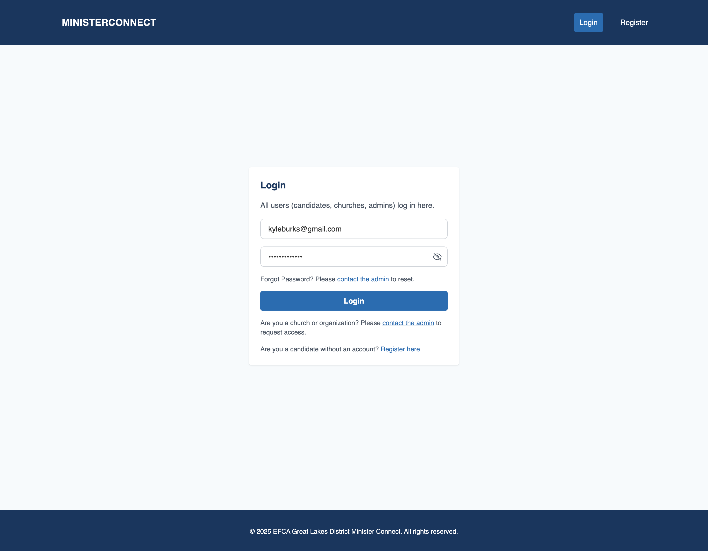

# Minister Connect

A multi-role Next.js application for connecting ministry candidates with churches, featuring role-based access for candidates, churches, admins, and super admins. Built with React, TypeScript, Tailwind CSS, and MSW for frontend development and API mocking.

## Features

### **For Candidates**
- **Profile Management**: Create and edit detailed ministry profiles with resume upload
- **Job Listings**: Browse available ministry positions with detailed job descriptions
- **Express Interest**: Show interest in specific job listings with one-click functionality
- **Profile Status Tracking**: Monitor approval status of submitted profiles
- **Document Upload**: Upload resumes and ministry videos

### **For Churches**
- **Job Posting**: Create detailed job listings with ministry type, employment details, and church information
- **Candidate Search**: Browse and search through approved candidate profiles
- **Express Interest**: Show interest in promising candidates
- **Mutual Interests**: View candidates who have expressed interest in your job listings
- **Church Profile Management**: Complete church profile with contact and location information

### **For Admins**
- **Content Moderation**: Review and approve/reject candidate profiles and job listings
- **User Management**: Monitor platform users and manage accounts
- **Invite Code Management**: Generate and manage registration invite codes
- **Church Oversight**: Review and manage church accounts

### **For Super Admins**
- **Complete Platform Management**: Full administrative control over the entire platform
- **User Management**: View, edit, and manage all user accounts (candidates, churches, admins)
- **Password Reset**: Reset passwords for any user with secure temporary password generation
- **Church Management**: Comprehensive church account oversight and status management
- **Profile Review**: Approve or reject candidate profiles with detailed review process
- **Invite Code System**: Advanced invite code management with usage tracking and expiration
- **Activity Monitoring**: Real-time dashboard with platform statistics and activity logs
- **Audit Trail**: Complete tracking of all administrative actions

## Quick Start

```bash
npm install
npm run dev
```

The application will be available at `http://localhost:3000`

## Backend Integration Preparation

Before setting up the backend service, the frontend has been prepared with:

- **API Client Configuration**: Centralized API calls in `src/utils/api.ts`
- **Environment Variables**: Template in `env.example` for backend configuration
- **Mock API**: MSW handlers for development without backend
- **Type Safety**: Complete TypeScript interfaces matching backend requirements

### Environment Setup

1. Copy `env.example` to `.env.local`
2. Set `NEXT_PUBLIC_API_URL` to your backend service URL
3. Use `npm run dev:backend` to run with backend configuration

### API Integration

The frontend uses a centralized API client that automatically switches between:
- Mock API (development without backend)
- Real backend API (when `NEXT_PUBLIC_API_URL` is set)

All API endpoints are defined in `src/utils/api.ts` for easy backend integration.

## Test Accounts

### **Super Admin**
- Email: `superadminuser@gmail.com`
- Password: `password`

### **Admin**
- Email: `adminuser@gmail.com`
- Password: `password`

### **Church**
- Email: `churchuser@gmail.com`
- Password: `password`

### **Candidate (Approved Profile)**
- Email: `approvedcandidateuser@gmail.com`
- Password: `password`

## Documentation

- **Use Case Diagram**: See `docs/use-case-diagram.puml` for the PlantUML source code
- **API Data Model**: See `API_DATA_MODEL.md` for detailed data structure information
- **User Scenarios**: See `docs/user_scenarios/` for detailed user workflows
- **Documentation**: See `docs/README.md` for additional documentation

### Use Case Diagram


## User Journey Screenshots

### Landing Page


### Login Page


### Register Page


### Candidate Dashboard


### Candidate Profile Form


### Candidate Job Listings


### Church Dashboard


### Church Create Job Listing


### Church Manage Jobs


### Church Candidate Search


### Church Mutual Interests


### Admin Dashboard


### Admin Review Profiles


### Admin Church Management


### Admin Create Church


### Admin Edit Church


### Admin Review Job Listings


### Admin Manage Invite Codes


### Super Admin Dashboard


### Super Admin User Management


### Super Admin Profile Management


### Super Admin Church Management


### Super Admin Invite Code Management


## Tech Stack

- [Next.js](https://nextjs.org/) (v15+)
- [React](https://react.dev/) (v19+)
- [TypeScript](https://www.typescriptlang.org/)
- [Tailwind CSS](https://tailwindcss.com/)
- [MSW (Mock Service Worker)](https://mswjs.io/)

---

## Getting Started

### Prerequisites

- Node.js (v18+ recommended)
- Yarn or npm

### Installation

1. Clone the repository:
   ```bash
   git clone <repository-url>
   cd ministerconnect
   ```
2. Install dependencies:
   ```bash
   yarn install
   # or
   npm install
   ```
3. Start the development server:
   ```bash
   yarn dev
   # or
   npm run dev
   ```
   The app will be available at [http://localhost:3000](http://localhost:3000).

### Building for Production

```bash
yarn build
yarn start
# or
npm run build
npm start
```

---

## Folder Structure

```